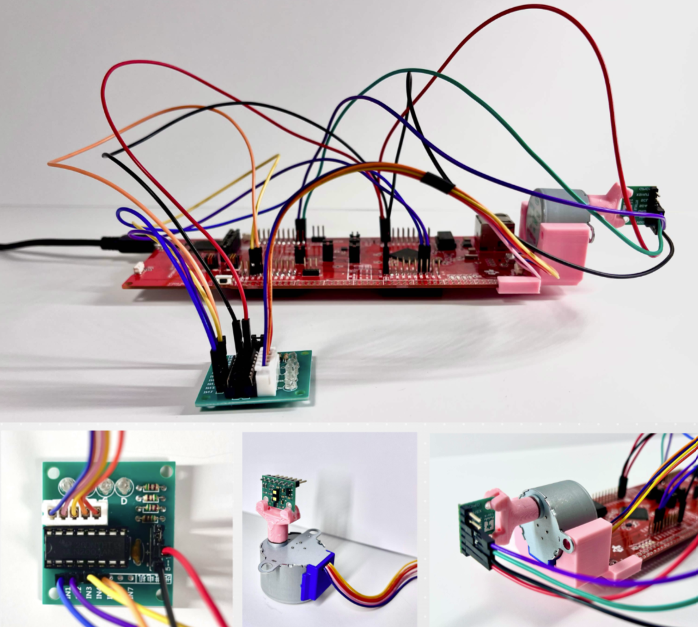
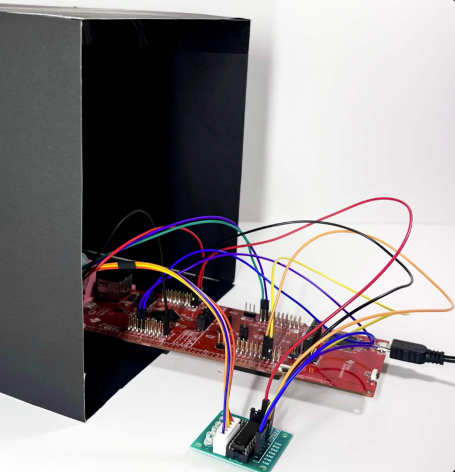
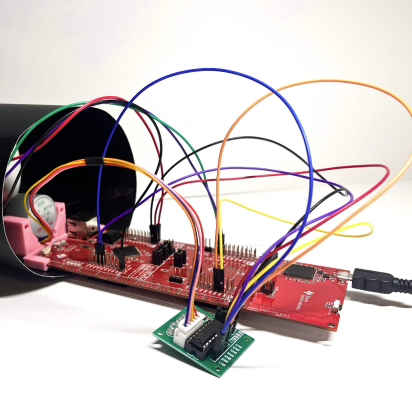
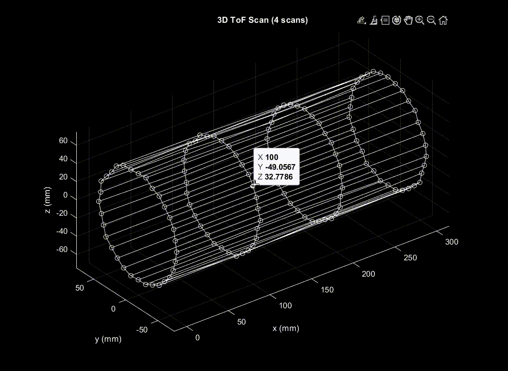
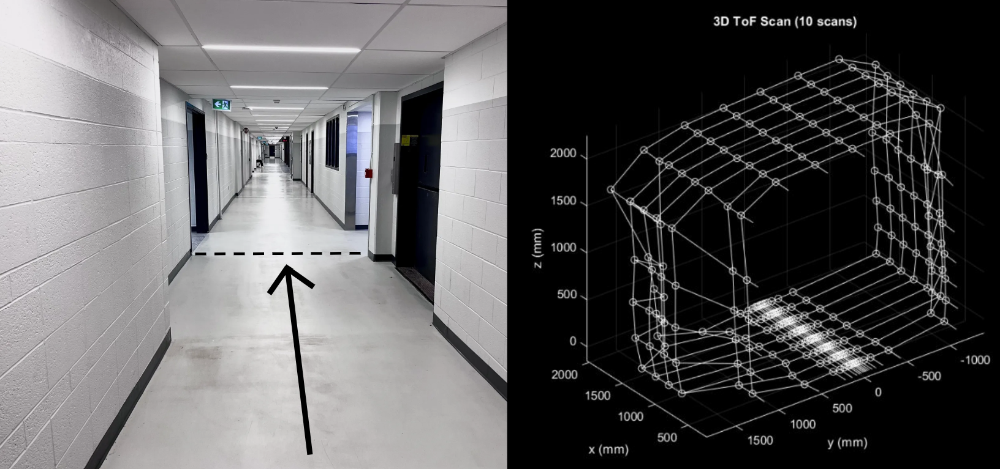
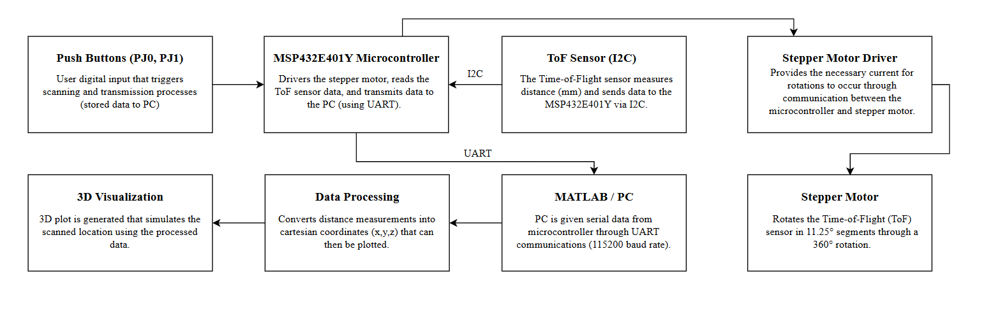
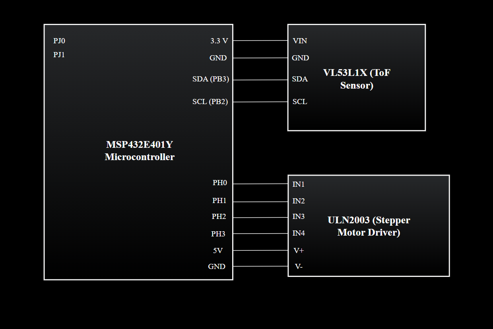

# 3D-Spatial-Mapping-System
Embedded system using a Time-of-Flight (ToF) sensor, stepper motor, and MATLAB visualization as a means to perform real-time 360° spatial mapping.

## Hardware Setup

## Example: Box Scan
The image below shows the physical object that was scanned, followed by the reconstructed 3D model generated from the collected ToF sensor data.

## Example: Cylindrical Object Scan
The image below shows the physical object that was scanned, followed by the reconstructed 3D model generated from the collected ToF sensor data.

## Hallway Reconstruction Scan

## System Block Diagram 

## Circuit Schematic

## Documentation
See `project_report.pdf` for a complete description of the hardware, software, and implementation details.
